```{r, echo=FALSE}
knitr::opts_chunk$set(error = TRUE)
```

# Introduction to Microbiota Data

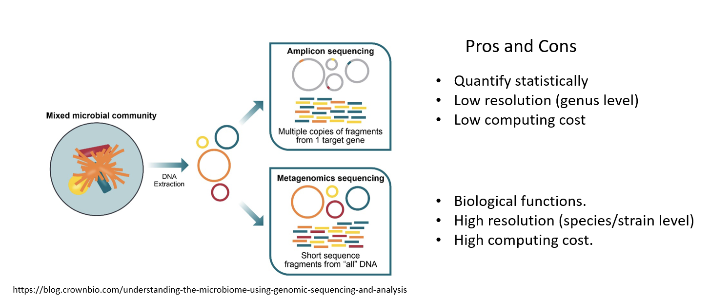{width="80%"}

<br/>

## Practical guide to microbiota data

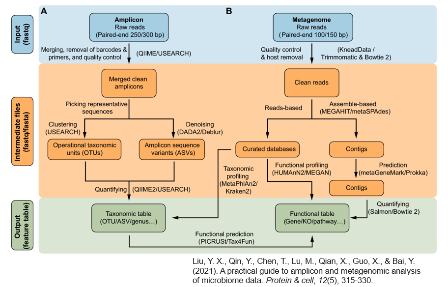{width="80%"}

### 16s rRNA amplicon

Highly conserved in bacteria and archaea, but contains nine
hypervariable region V1-V9

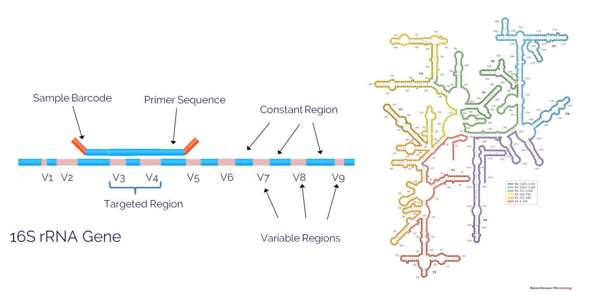{width="80%"}

<br/>

### Sequence process for amplicon data

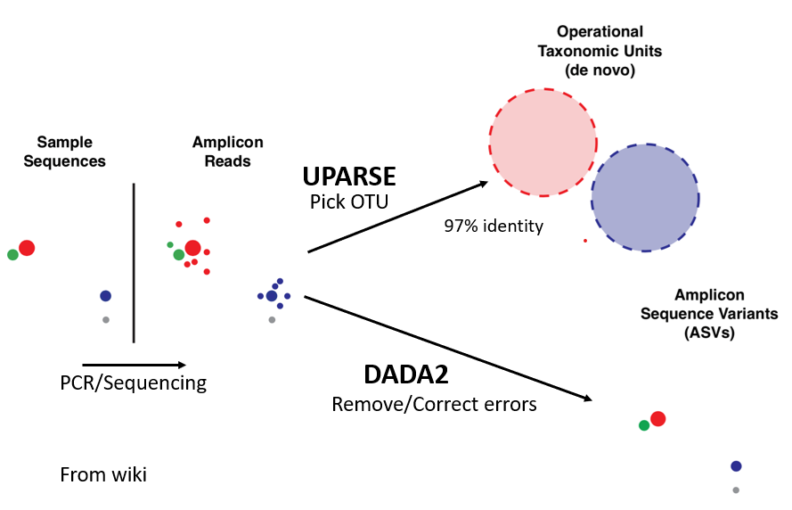{width="80%"}

Reference database :

For bacteria

1.  [**SILVA** v138.2](https://www.arb-silva.de/), (2024, Nov.)

2.  [**RDP** v19](https://zenodo.org/records/14168771), (2023, Aug.)

3.  [**GreenGenes
    v2**](https://www.nature.com/articles/s41587-023-01845-1), (2024,
    Sep.)

For fungi

-   [**UNITE v10**](https://unite.ut.ee/repository.php), (2025, Feb.)

<br/>

## Pipeline for 16S rRNA amplicon

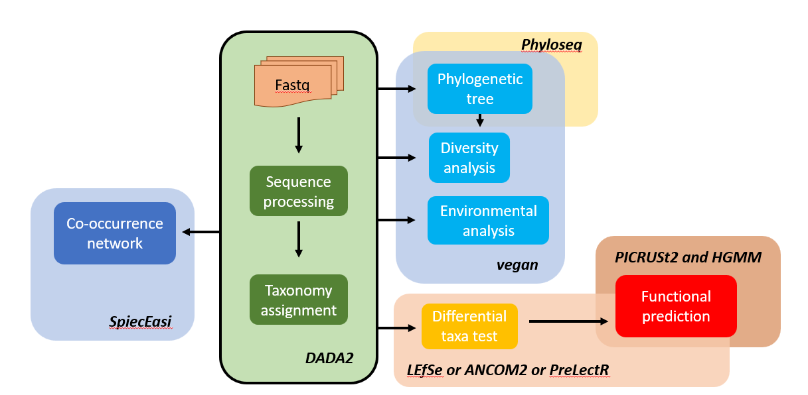{width="80%"}

<br/>

#### FASTQ format

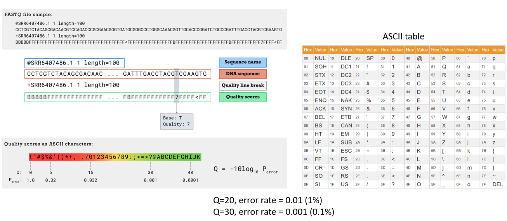{width="80%"}

<br/>

------------------------------------------------------------------------

## DADA2 pipeline tutorial

Please refer directly to the original
[page](https://benjjneb.github.io/dada2/tutorial.html)

### Step 1. Inspect read quality profiles

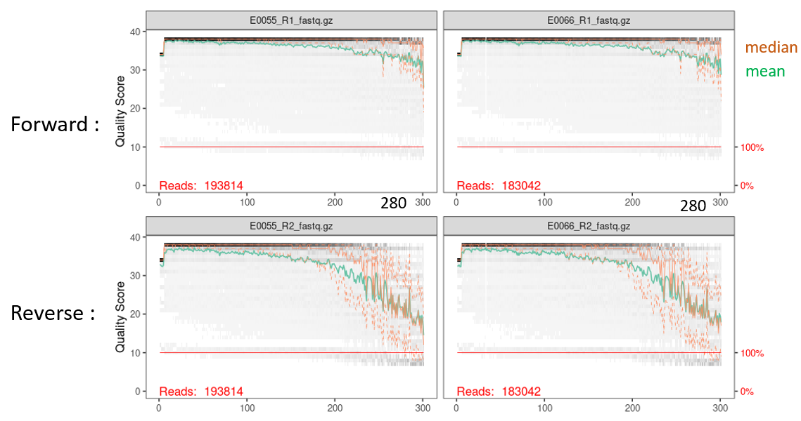{width="100%"}

<br/>

### Step 2. Filter and trim

The key parameters for this step are `truncLen` and `trimLeft`.

To prevent adapter sequence contamination, use `trimLeft` to remove
bases from the 5' end of the reads.

To ensure sequence quality, use `truncLen` to truncate reads after
assignment.

There are two important criteria to consider:

-   After filtering, at least 80% of the reads should be retained.

-   The V3-V4 region typically ranges from 360 to 420 nt in length, so
    the combined length of paired-end reads after truncation should be
    at least 400 nt to ensure sufficient overlap.

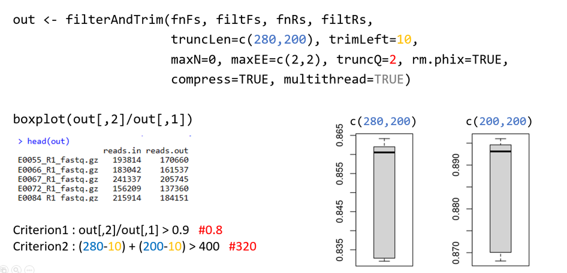{width="80%"}

<br/>

### Step 3. Sequence processing

Follow the standard procedures and verify the length of the merged
sequences.

```{r, eval=FALSE}
# Learn the Error Rates
errF <- learnErrors(filtFs, multithread=TRUE)
...

# Sample Inference
dadaFs <- dada(filtFs, err=errF, multithread=TRUE)
...

# Merge paired reads
mergers <- mergePairs(dadaFs, filtFs, dadaRs, filtRs, verbose=TRUE)
seqtab <- makeSequenceTable(mergers)
dim(seqtab) # [n_smaple, n_ASVs]

# Inspect distribution of sequence lengths
hist(nchar(getSequences(seqtab)))

# Remove chimeras
seqtab.nochim <- removeBimeraDenovo(seqtab, method="consensus", multithread=TRUE, verbose=TRUE)
...

# Assign taxonomy
taxa <- assignTaxonomy(seqtab.nochim, "~/tax/silva_nr_v132_train_set.fa.gz", multithread=TRUE)
taxa <- addSpecies(taxa, "~/tax/silva_species_assignment_v132.fa.gz")

```

<br/>

### Step 4. Sample QC

```{r, eval=FALSE}
getN <- function(x) sum(getUniques(x))
track <- cbind(out, sapply(dadaFs, getN), sapply(dadaRs, getN), sapply(mergers, getN), rowSums(seqtab.nochim))
colnames(track) <- c("input", "filtered", "denoisedF", "denoisedR", "merged", "nonchim")
rownames(track) <- sample.names
mitochondria_id <- rownames(taxa)[taxa[,5] %in% "Mitochondria"]
unclassification_id <-rownames(taxa)[taxa[,1] != "Bacteria" | is.na(taxa[,2])]
keep_id <- rownames(taxa)[!rownames(taxa) %in% mitochondria_id)]
get_seqN <- function(table,list){
  if(length(list) == 0) { return(rep(0,nrow(table)))
  } else if(length(list) > 1) { return(rowSums(table[,list]))
  } else { return(sapply(table[,list],sum))}
}
track <- cbind(track, get_seqN(seqtab, mitochondria_id), get_seqN(seqtab,keep_id))
colnames(track) <-  c("input", "filtered", "denoisedF", "denoisedR", "merged", "nonchim","mitochondria","final")
track <- track[keep_sample,]
keep_sample <- rownames(track)[track[,8]/track[,6] > 0.5]  # remove the sample with host contamination > 50%
seqtab <- seqtab[keep_sample,keep_id]
nozeroASV <- colnames(seqtab)[colSums(seqtab) > 0]
seqtab <- seqtab[,nozeroASV]
taxa <- taxa[nozeroASV,]
```

### Step 5. Serial number and output

```{r, eval=FALSE}
source("source/utils.R")
output_path <- '~/dada2_output'
DADA2Adapter(seqtab.nochim, taxa, output_path)  # DADA2Adapter function is sourced from utils.R
dir(output_path)

data <- read.csv(paste0(output_path,'/ASV_table.txt'), sep = '\t')
taxa <- read.csv(paste0(output_path,'/ASV_taxa_table.txt'), sep = '\t')
```

### Step 6. Phylogenetic tree building (1)

The phylogenetic tree can be directly constructed using `DECIPHER`.
However, fitting a GTR model is time-consuming (5hr-10hr), and
installing `DECIPHER` can be challenging.

```{r, eval=FALSE}
library(dada2)
library(DECIPHER)
library(phangorn)

seqs <- getSequences(seqtab.nochim)
magnitude <- ceiling(log10(ncol(seqtab.nochim)))
ASVID <- sprintf(paste0("ASV%0", magnitude, "d"), 1:n_ASVs)


names(seqs) <- ASVID
alignment <- AlignSeqs(DNAStringSet(seqs), anchor=NA,verbose=TRUE)

phangAlign <- phyDat(as(alignment, "matrix"), type="DNA")
dm <- dist.ml(phangAlign)
treeNJ <- NJ(dm)
fit = pml(treeNJ, data=phangAlign)
fitGTR <- update(fit, k=4, inv=0.2)
fitGTR <- optim.pml(fitGTR, model="GTR", optInv=TRUE, optGamma=TRUE,
                    rearrangement = "stochastic", control = pml.control(trace = 0))
fitGTR$tree

write.tree(fitGTR$tree, file = paste0(output_path,'/ASV.tree'), append = FALSE,
           digits = 10, tree.names = FALSE)
```

<br/>

### Step 6. Phylogenetic tree building (2)

So we provider an alternative approach. Since 16S ribosomal sequences
contained the non-coding sequence and secondary structure, the alignment
method was considered. We suggest to use
[ssu-align](http://eddylab.org/software/ssu-align/) to do alignment for
phylogenetic inference. The detailed process is as follows.

```{bash, eval=FALSE}
# ssu-align installation
$ wget eddylab.org/software/ssu-align/ssu-align-0.1.1.tar.gz;
$ tar xfz ssu-align-0.1.1.tar.gz
$ cd ssu-align-0.1.1
$ ./configure
$ make
# install the man pages and programs in system-wide directories:
$ make install

$ export PATH="$PATH:/usr/local/bin"
$ export MANPATH="$MANPATH:/usr/local/share/man"
$ export SSUALIGNDIR="/usr/local/share/ssu-align-0.1.1"

# conduct SSU-alignment
$ cd ~/Course/NDMC_2025/tmp
$ ssu-align ASV.fasta ssuout
$ cd ssuout
```

The alignment result is generated in `ssuout/ssuout.bacteria.stk`.

We can convert the `.stk` file to FASTA format using
`alignment_transform.R`, located in the source folder.

```{bash, eval=FALSE}
$ Rscript --vanilla ~/Course/NDMC_2025/source/alignment_transform.R ~/Course/NDMC_2025/tmp/ssuout/ssuout.bacteria.stk ~/Course/NDMC_2025/tmp/ssuout/ssu_aligned.fasta
```

In order to shorten the processing time, we use the
[FastTree](http://www.microbesonline.org/fasttree/) for
maximum-likelihood phylogenetic tree completion. If time is available,
[RAxML](https://cme.h-its.org/exelixis/web/software/raxml/) is suggested
to get the better quality tree.

```{bash, eval=FALSE}
$ cd ~/Course/NDMC_2025/tmp
$ ~/bin/FastTree -gtr -nt ./ssuout/ssu_align.fasta > ./ASV.tree
```

<br/>

# Diversity Analysis

```{r, include=FALSE}
rm(list=ls())
```

The fecal microbiota data which from PRJEB6070 [(Zeller et al.,
2016)](https://pubmed.ncbi.nlm.nih.gov/25432777/) is used in this
demonstration. We subsetted this dataset, including 20 patients each
from the normal and cancer groups, and used the DADA2 pipeline to
complete the analysis up to the taxonomic assignment step.

Please ensure that the packages listed in `prep_help.R` are installed.

```{r, echo = TRUE, message = FALSE, warning = FALSE, collapse=TRUE}
library(dada2)
library(dplyr)
library(DECIPHER)
library(phangorn)
library(matrixStats)
library(ggpubr)
library(ggplot2)
library(picante)
library(phyloseq)
library(patchwork)
library(rstatix)
library(tidyverse)
library(vegan)
library(scales)

source("source/utils.R")
```

```{r, eval = TRUE, warning=FALSE, collapse=TRUE}
dataset_path <- "~/Course/NDMC_2025/data/Zeller_CRC.RData"
load(dataset_path)
print(ls())

# Check patients condition
print(table(meta$Class))
print(table(meta$diagnosis))

# The clinical factor for time-to-event testing
meta$event <- ifelse(meta$Class == 'Cancer', 1, 0)  # as events
meta$duration <- meta$age                           # as duration
```

We designed the `DADA2Adapter` function to bridge the data into the
`PreLect` pipeline.

```{r, eval = TRUE, warning=FALSE, collapse=TRUE}
# set the working  directory 
output_path <- '/home/yincheng23/Course/NDMC_2025/tmp'

# generate the raw count table, taxa table and ASV sequence fasta
DADA2Adapter(seqtab.nochim, taxa, output_path) # DADA2Adapter function is sourced from utils.R
dir(output_path)

# load the data we need
data <- read.csv(paste0(output_path,'/ASV_table.txt'), sep = '\t')
taxa <- read.csv(paste0(output_path,'/ASV_taxa_table.txt'), sep = '\t')
taxa[is.na(taxa)] <- "unidentified"
```

## Alpha diversity

Alpha diversity describes the species diversity within a community.

### Rarefaction normalization

Since various range of sequencing depth in data, we usually conduct the
rarefaction normalization to 'fairly' compare the diversity metrics.

```{r, message = FALSE, warning = FALSE, fig.width=6, fig.height=4}
# Rarefaction curve
ASV = otu_table(data, taxa_are_rows = TRUE)
TAX = tax_table(as.matrix(taxa))
physeq = phyloseq(ASV, TAX)
sampledata = sample_data(meta)
physeq = merge_phyloseq(physeq, sampledata)

min_depth <- min(colSums(data))
print(min_depth)

# ggrare function is sourced from utils.R
ggrare(physeq, step = 1500, colour = "Class", se = FALSE) +
  scale_colour_brewer(palette="Set1") +
  geom_vline(xintercept = min_depth, linetype = 'dotdash') + 
  theme(axis.line = element_line(linetype = 1,colour = 'black'),
  panel.background = element_rect(I(0)),
  panel.grid.major = element_line(colour = NA),
  panel.grid.minor = element_line(colour = NA))
```

<br/>

The upper picture show the library size vs. number of observed species,
in rarefaction process, we limited the all samples in minimum depth
**(black dotdash)**, and then randomly discarding reads from larger
samples until the number of remaining samples is equal to this threshold

```{r, collapse=TRUE}
# Rarefaction
print(colSums(data)[1:16])
min <- min(colSums(data))
data_rarefied <- t(rrarefy(t(data), min))
data_rarefied <- data_rarefied[rowSums(data_rarefied) > 0,]
print(colSums(data_rarefied)[1:16])
```

<br/>

After rarefaction, All the sample size are equality, we can calculate
the various alpha index to each sample.

```{r, collapse=TRUE, message = FALSE, warning = FALSE}
dir(output_path)

# load the data we need
tree <- read.tree(paste0(output_path,'/ASV.tree'))
a <- cophenetic(tree)     #check the root by farthest phylogenetic distance ASV
rowSums(a)[order(rowSums(a), decreasing = T )][1:8]
tree <- root(tree, "ASV2154", resolve.root = T)

AlphaIndex <- data.frame(Shannon = diversity(t(data_rarefied) ,index  = "shannon"),
                         Chao1 = estimateR(t(data_rarefied))[2,],
                         Simpson = diversity(t(data_rarefied) ,index  = "simpson"),
                         invSimpson = diversity(t(data_rarefied) ,index  = "invsimpson"),
                         PD = pd(t(data_rarefied), tree)[,1],
                         group = meta$Class)
```

<br/>

### Shannon diversity

$$ H_{sw} = - \sum_{i = 1}^{s} (\frac{n_i}{N}) \ln(\frac{n_i}{N}) $$

[Shannon and Wiener
(1963)](https://monoskop.org/images/b/be/Shannon_Claude_E_Weaver_Warren_The_Mathematical_Theory_of_Communication_1963.pdf)
is base on information theory, $N$ is total number of individual, and
$n_i$ is the number of individual belong in species $i$. The more the
number of species and the more evenly distributed the individuals are,
the higher the index it get. Therefore, $H_{sw}$ can be regarded as
`equitability`.

```{r, collapse=TRUE, message = FALSE, warning = FALSE, out.height='70%', out.width='70%', fig.width=4, fig.height=3}
pwc <- wilcox_test(Shannon ~ group, paired = F, p.adjust.method = "None", data = AlphaIndex)
pwc <- pwc %>% add_xy_position(x = "group")
ggboxplot(AlphaIndex, x = "group", y = "Shannon", add = "point", fill = "group") +
  scale_fill_brewer(palette = "Set1") + ylab("Shannon index") +
  stat_pvalue_manual(pwc, hide.ns = TRUE) +
  labs(caption = get_pwc_label(pwc))
```

<br/>

### Chao1 richness

$$ S = S_{obs} + \frac{F^2_1}{2F_2} $$ In Chao1 estimator [(Chao, A.
1984)](https://www.researchgate.net/publication/268975118_Non-parametric_estimation_of_the_classes_in_a_population).
$S_{obs}$ is indicated the number of observed species, $F_1$ is the
number of species which only once. and $F_2$ is the number of species
which twice in community. Higher $F_1$ indicates that the number of
non-observed species is likely to be higher. It is expected that the
community will have a relatively high abundance of species. but $F_2$
show the species have occurred at least twice, then the chance of new
species occurring in the community is low.

```{r, collapse=TRUE, message = FALSE, warning = FALSE, out.height='70%', out.width='70%', fig.width=4, fig.height=3}
pwc <- wilcox_test(Chao1 ~ group, paired = F, p.adjust.method = "None", data = AlphaIndex)
pwc <- pwc %>% add_xy_position(x = "group")
ggboxplot(AlphaIndex, x = "group", y = "Chao1", add = "point", fill = "group") +
  scale_fill_brewer(palette = "Set1") + ylab("Chao1 richness") +
  stat_pvalue_manual(pwc, hide.ns = TRUE) +
  labs(caption = get_pwc_label(pwc))

```

<br/>

### Simpson index

$$ D_s = \sum_{i = 1}^{s} (\frac{n_i}{N})^2  \ ;\ \  D_{s^\prime    }  =  \frac{1}{D_s} $$

[Simpson (1949)](https://www.nature.com/articles/163688a0) is measure
the dominance in single community. if some species is dominant in
community, the Simpson will be higher. so it can be regarded as
`concentration index`. In other words, the inverse Simpson index is show
the `evenness` in community.

```{r, collapse=TRUE, message = FALSE, warning = FALSE, out.height='70%', out.width='70%', fig.width=4, fig.height=3}
pwc <- wilcox_test(Simpson ~ group, paired = F, p.adjust.method = "None", data = AlphaIndex)
pwc <- pwc %>% add_xy_position(x = "group")
ggboxplot(AlphaIndex, x = "group", y = "invSimpson", add = "point", fill = "group") +
  scale_fill_brewer(palette = "Set1") + ylab("inverse Simpson index") +
  stat_pvalue_manual(pwc, hide.ns = TRUE) +
  labs(caption = get_pwc_label(pwc))
```

<br/>

### Phylogenetic diversity

Faith's Phylogenetic Diversity [(Faith D.,
1992)](https://www.sciencedirect.com/science/article/abs/pii/0006320792912013)
which is defined as the sum of the branch lengths of a phylogenetic tree
connecting all species, this means that PD indicates
`Feature diversity`.

```{r, collapse=TRUE, message = FALSE, warning = FALSE, out.height='70%', out.width='70%', fig.width=4, fig.height=3}
pwc <- wilcox_test(PD ~ group, paired = F, p.adjust.method = "None", data = AlphaIndex)
pwc <- pwc %>% add_xy_position(x = "group")
ggboxplot(AlphaIndex, x = "group", y = "PD", add = "point", fill = "group") +
  scale_fill_brewer(palette = "Set1") + ylab("Faith’s phylogenetic diversity") +
  stat_pvalue_manual(pwc, hide.ns = TRUE) +
  labs(caption = get_pwc_label(pwc))
```

<br/> <br/>

## Beta diversity

### Bray-Curtis distance

$$ D_{BC} = \frac{\sum_{i=1}^S{|M_{i1} - M_{i2}|}}{\sum_{i=1}^S{M_{i1} + M_{i2}}} $$

In
[Bray-Curtis](https://esajournals.onlinelibrary.wiley.com/doi/10.2307/1942268)
distance, $S$ is indicates the total number of species in two
communities, $M_{i1}$ is means the number of species $i$ in community 1,
and so on. This method is similar to Sørensen index. and usually
utilizes non-metric multidimensional scaling
[nMDS](https://strata.uga.edu/software/pdf/mdsTutorial.pdf) for
dimension reduction.

```{r, collapse=TRUE, message = FALSE, warning = FALSE, out.height='70%', out.width='70%'}
NMDS=metaMDS(t(data_rarefied), distance = "bray")
NMDSplot <- as.data.frame(NMDS$points)
NMDSplot$group <- meta$Class
prop <- cmdscale(vegdist(t(data_rarefied), method = "bray"), k = 2, eig = T, add = T )
prop <- round(prop$eig*100/sum(prop$eig),1)
print(prop[1:8]) # chick the proportion of variance explained
stressplot(NMDS) # chick the fitness in nMDS
ggscatter(NMDSplot, x = "MDS1", y = "MDS2",combine  = T, color = 'group',
          ellipse.type = "norm", ellipse = T,ellipse.level = 0.5, ellipse.alpha = 0.5, repel = TRUE) +
          scale_color_manual(values = c("#CC0000","#FFAA33"))+
          scale_fill_manual(values = c("#CC0000","#FFAA33")) +
          xlab(paste0(c('PC1 (', prop[1],'% var.explained)'), collapse = "")) + 
          ylab(paste0(c('PC1 (', prop[2],'% var.explained)'), collapse = "")) +
          theme(panel.background = element_rect(fill = 'transparent'),
                panel.grid = element_blank(),
                axis.ticks.length = unit(0.4,"lines"),
                axis.ticks = element_line(color='black'),
                axis.line = element_line(colour = "black"),
                legend.title=element_blank(),
                legend.position  = 'right')
```

Ellipse type can choose the `convex`, `confidence`, `t`, `euclid`.

<br/>

### Unifrac distance

-   unWeighted
    $$ U_{uw} = \frac{\sum_{i=1}^N{l_i|A_{i} - B_{i}|}}{\sum_{i=1}^N{ max(A_{i} + B_{i})}} $$

-   Weighted
    $$ U_{w} = \frac{\sum_{i=1}^n{b_i| \frac{A_{i}}{A_T} - \frac{B_{i}}{B_T}|}}{\sum_{j=1}^S{L_j}} $$

```{r, collapse=TRUE, message = FALSE, warning = FALSE, out.height='70%', out.width='70%'}
ASV = otu_table(data_rarefied, taxa_are_rows = TRUE)
TAX = tax_table(as.matrix(taxa))
physeq = phyloseq(ASV, TAX, tree)
Unif = UniFrac(physeq, weighted = F, normalized = F, parallel = F)  # if weighted = TRUE; then weighted UniFrac
Unif_d <- pcoa(Unif)
Unifplot <- data.frame(axis1 = as.numeric(Unif_d$vectors[,1]),
                       axis2 = as.numeric(Unif_d$vectors[,2]))
Unifplot$group <- meta$Class
prop <- cmdscale(Unif, k = 2, eig = T, add = T)
prop <- round(prop$eig*100/sum(prop$eig),1)
print(prop[1:8]) # chick the proportion of variance explained

ggscatter(Unifplot, x = "axis1", y = "axis2",combine = T, color = 'group',
          ellipse.type = "norm", ellipse = T,ellipse.level = 0.5, ellipse.alpha = 0.5, repel = TRUE) +
          scale_color_manual(values = c("#CC0000","#FFAA33"))+
          scale_fill_manual(values = c("#CC0000","#FFAA33")) +
          xlab(paste0(c('PCoA1 (', prop[1],'% var.explained)'), collapse = "")) + 
          ylab(paste0(c('PCoA1 (', prop[2],'% var.explained)'), collapse = "")) +
          theme(panel.background = element_rect(fill = 'transparent'),
                panel.grid = element_blank(),
                axis.ticks.length = unit(0.4,"lines"),
                axis.ticks = element_line(color='black'),
                axis.line = element_line(colour = "black"),
                legend.title=element_blank(),
                legend.position  = 'right')
```

<br/>

### ANOSIM

Analysis of similarities `(ANOSIM)` is a non-parametric statistical test
widely used in the field of ecology. As an ANOVA-like test, where
instead of operating on raw data, operates on a ranked dissimilarity
matrix.

Given a matrix of rank dissimilarities between a set of samples, each
solely belong to one treatment group, the ANOSIM tests whether we can
reject the null hypothesis that the similarity between groups is greater
than or equal to the similarity within the groups.

The test statistic R is calculated in the following way:

$$ R={\frac {\bar{r_{B}}-\bar{r_{W}}}{M/2}} $$

where $\bar{r_{B}}$ is the average of rank similarities of pairs of
samples (or replicates) originating from different sites, $\bar{r_W}$ is
the average of rank similarity of pairs among replicates within sites,
and $M$ = n(n − 1)/2 where n is the number of samples.

```{r, collapse=TRUE, message = FALSE, warning = FALSE}
anosim(vegdist(t(data_rarefied), method = "bray"), meta$Class)
anosim(Unif, meta$Class)
```

<br/>

### adonis2

Permutational Multivariate Analysis of Variance `(adonis)`,

```{r, collapse=TRUE, message = FALSE, warning = FALSE}
adonis2(t(data_rarefied) ~ Class, data = meta, method= "bray")
adonis2(Unif ~ Class, data = meta)
```

<br/>

## Community composition

sort by major species decrease

```{r, collapse=TRUE, message = FALSE, warning = FALSE, fig.width=10, fig.height=5}
# choose the taxonomic rank for visualization
print(colnames(taxa))
# get_composition function is sourced from utils.R
compair <- get_composition(data, taxa, 'Order', meta, 'Class')

ggplot(compair, aes(x = sample, y = percentage, fill = taxa)) + 
  geom_bar(stat="identity",colour = "black") + scale_fill_brewer(palette = "Paired") +
  labs(fill = "Order") + ylab("Relative abundance (%)") + 
  #facet_grid(~group, space="free", scales="free") + # separate the group
  theme(axis.text.x = element_blank(),
        axis.line = element_line(linetype = 1,colour = 'black'),
        panel.background = element_rect(I(0)),
        panel.grid.major = element_line(colour = NA),
        panel.grid.minor = element_line(colour = NA),
        text = element_text(size=16))
```

<br/>

sort by hierarchical clustering

```{r, collapse=TRUE, message = FALSE, warning = FALSE, fig.width=10, fig.height=5}
compair_2D <- reshape(compair[,1:3], idvar = "sample", timevar = "taxa", direction = "wide")
rownames(compair_2D) <- compair_2D[,1]
compair_2D <- compair_2D[,2:ncol(compair_2D)]
horder <- hclust(dist(compair_2D), method = 'ward.D')
horder <- horder$labels[horder$order]
compair$sample <- factor(compair$sample, levels = horder)

ggplot(compair, aes(x = sample, y = percentage, fill = taxa)) + 
  geom_bar(stat="identity",colour = "black") + scale_fill_brewer(palette = "Paired") +
  labs(fill = "Order") + ylab("Relative abundance (%)") + 
  #facet_grid(~group, space="free", scales="free") + # separate the group
  theme(axis.text.x = element_blank(),
        axis.line = element_line(linetype = 1,colour = 'black'),
        panel.background = element_rect(I(0)),
        panel.grid.major = element_line(colour = NA),
        panel.grid.minor = element_line(colour = NA),
        text = element_text(size=16))
```

<br/>


# Environmental Analysis

To demonstrate how the environmental factor impacting in microbiota, we
use wetland microbiota which characterised by ions concentration. the
soil samples were collected from 4 wetland in southern Taiwan and named
as AA, BB, CC, DD respectively. and each sample had be measured with
LCMS.

```{r, echo = TRUE, message = FALSE, warning = FALSE, collapse=TRUE}
wetland <- read.table("~/Course/NDMC_2025/data/wetland/ASV_table.txt", sep = "\t", stringsAsFactors = F)
ion <- read.table("~/Course/NDMC_2025/data/wetland/ion.txt", sep = "\t", stringsAsFactors = F)
wetland <- wetland[,rownames(ion)]
head(wetland[,1:5])
head(ion)
```

## Mantel test

The Mantel test computes the Pearson or Spearman correlation between two
distance matrices and evaluates its significance using a permutation
test.

```{r, echo = TRUE, message = FALSE, warning = FALSE, collapse=TRUE}
min <- min(colSums(wetland))
wetland_rarefied <- t(rrarefy(t(wetland), min))
wetland_rarefied <- wetland_rarefied[rowSums(wetland_rarefied) > 0,]

manteldf <- data.frame(Factor = 0, rho = 0, p_value = 0)
count <- 1
for(i in 1:ncol(ion)){
  Mantel_res <- mantel(dist(ion[,i]),vegdist(t(wetland_rarefied)), method = "spearman")
  manteldf[count,1] <- colnames(ion)[i]
  manteldf[count,2] <- round(Mantel_res$statistic,4)
  manteldf[count,3] <- round(Mantel_res$signif,4)
  count = count + 1
}
manteldf
```

<br/>

## BioENV

This finds the best subset of environmental variables, so that the
Euclidean distances of scaled environmental variables have the maximum
(rank) correlation with community dissimilarities.

```{r, echo = TRUE, message = FALSE, warning = FALSE, collapse=TRUE}
bio <- bioenv(as.formula(paste("t(wetland_rarefied)~ ", paste(colnames(ion), collapse = " + "))), ion)
bio <- summary(bio)
df <- data.frame(Factor = bio$variables, rank = bio$size, rho = bio$correlation)
df
```

<br/>


## CCA

[Canonical Correspondence Analysis (CCA)](https://uw.pressbooks.pub/appliedmultivariatestatistics/chapter/ca-dca-and-cca/) is an ordination technique that directly relates species composition to environmental variables. CCA is based on Chi-square distances, which measure differences in species composition between samples, and uses a constrained ordination approach to maximize the correlation between species distributions and environmental gradients.

Given a species abundance matrix  and an environmental variable matrix , CCA seeks to find axes that maximize the weighted correlation between species composition and environmental variables. The species scores are derived based on weighted averaging, ensuring that species are positioned optimally along the environmental gradients. This makes CCA particularly suitable for ecological datasets where species exhibit unimodal responses to environmental gradients.

```{r, echo = TRUE, message = FALSE, warning = FALSE, collapse=TRUE, eval=TRUE}
#CCA <- cca(as.formula(paste("t(wetland_rarefied)~", paste(colnames(ion), collapse = " + "))), ion)
CCA <- cca(t(wetland_rarefied)~ Na + Ca + Cl+ EC + Salinity + pH, ion)
#cca_temp <- anova.cca(CCA)
cca_term <- anova.cca(CCA, by="terms")
cca_term        
```

```{r, echo = TRUE, message = FALSE, warning = FALSE, collapse=TRUE, eval=TRUE, fig.width=4, fig.height=3}
CCAscores <- scores(CCA, display = "sites") %>% 
               as.data.frame() %>% rownames_to_column("site")
CCAscores$group <- substr(rownames(ion),1,2)
cc <- data.frame(CCA$CCA$biplot)

ggplot() + geom_point(data = CCAscores, aes(x = CCA1, y = CCA2, color=group), alpha=1) +
    geom_vline(xintercept = c(0), color = "grey70", linetype = 2) +
    geom_hline(yintercept = c(0), color = "grey70", linetype = 2) +
    geom_segment(data = cc, aes(x = 0, y = 0, xend = CCA1, yend = CCA2), arrow = arrow(length = unit(0.2, "cm"))) +
    scale_color_brewer(palette = 'Set1') +
    geom_text(data = cc, aes(x = CCA1, y = CCA2, label = rownames(cc))) + theme_bw() +
    labs(x = paste0("CCA1 (",round(CCA$CCA$eig[1] / CCA$tot.chi*100,2), "% var. explained)"),
         y = paste0("CCA2 (",round(CCA$CCA$eig[2] / CCA$tot.chi*100,2), "% var. explained)"),
         title = "Canonical Correspondence Analysis") +
    theme(legend.text.align = 0, legend.title.align = 0,
          legend.title=element_text(size=10),legend.text=element_text(size=10))
```

#### The arch effect in CCA

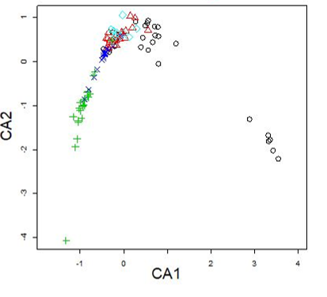{width="70%"}

A common artifact in CCA is the arch effect, a curvature in the ordination space that arises when species distributions follow strong unimodal patterns. This occurs because Chi-square distances emphasize differences in species presence and absence, leading to distortions in the ordination space. As a result, sites along a continuous environmental gradient may appear curved instead of following a linear progression.


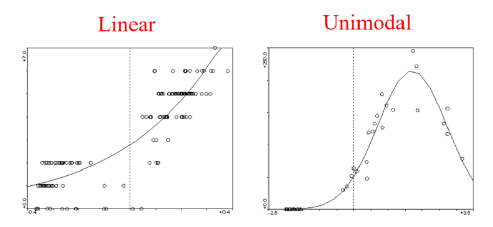{width="80%"}


x-axis is environmental gradient and y-axis is abundance of species.

reference :

+ [David Zelený Lab at NTU](https://www.davidzeleny.net/anadat-r/doku.php/en:ca_dca)

+ [slideplayer](https://slideplayer.com/slide/776318/)


## DCA

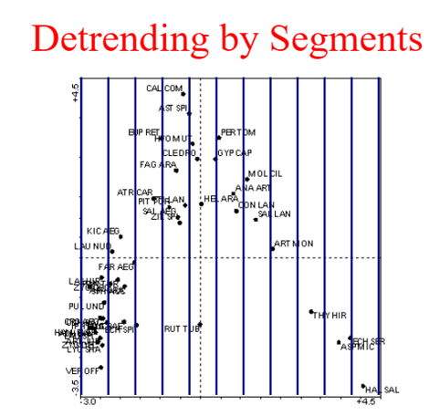{width="60%"}

To correct the arch effect, Detrended Correspondence Analysis (DCA) was introduced. DCA is a modification of Correspondence Analysis (CA) that removes the arch effect through segment-wise detrending and local standardization.

#### Segment-wise Detrending

DCA first computes an initial ordination using Correspondence Analysis (CA). However, instead of allowing the first axis to curve, DCA splits the axis into equal segments and removes the local mean within each segment. This eliminates the arch effect and ensures that the ordination axis follows a straight gradient.

#### Local Standardization

In addition to detrending, DCA adjusts species scores to equalize species variance across the axis. This prevents overemphasis on dominant species and ensures that species with different dispersions are treated equally.

#### DCA First Axis and Gradient Length

The `first DCA axis (DCA1)` represents the primary gradient in species composition. The length of the axis, measured in standard deviation (SD) units, indicates the degree of species turnover:

 + If first axis length < 2 SD:

species distributions follow a linear pattern, making `Redundancy Analysis (RDA)` more appropriate.

+ If first axis length > 4 SD:

species distributions follow a unimodal response, meaning `CCA` is the better choice.


```{r, echo = TRUE, message = FALSE, warning = FALSE, collapse=TRUE}
DCA <- decorana(t(wetland_rarefied))
DCA
```

```{r, echo = TRUE, message = FALSE, warning = FALSE, collapse=TRUE}
#dca_factor <- envfit(as.formula(paste("DCA~ ", paste(colnames(ion), collapse = " + "))), data = ion)
dca_factor <- envfit(DCA~ Na + Ca + Cl+ EC + Salinity + pH, data = ion)
dca_factor
```

```{r, echo = TRUE, message = FALSE, warning = FALSE, collapse=TRUE, fig.width=4, fig.height=3, eval=TRUE}
dcv <- data.frame(dca_factor$vectors$arrows)
DCA_sum <- as.data.frame(summary(DCA)$site.scores)
DCAscores <- DCA_sum %>% rownames_to_column("site")
DCAscores$group <- substr(rownames(ion),1,2)

ggplot() + geom_point(data = DCAscores, aes(x = DCA1, y = DCA2, color = group), alpha=1) +
    geom_vline(xintercept = c(0), color = "grey70", linetype = 2) +
    geom_hline(yintercept = c(0), color = "grey70", linetype = 2) +
    geom_segment(data = dcv, aes(x = 0, y = 0, xend = DCA1, yend = DCA2), arrow = arrow(length = unit(0.2, "cm"))) +
    geom_text(data = dcv, aes(x = DCA1, y = DCA2, label = rownames(dcv))) + theme_bw() +
    scale_color_brewer(palette = 'Set1') + 
    labs(x = paste0("DCA1 (",round(DCA$evals[1] / DCA$totchi*100,2), "% var. explained)"),
         y = paste0("DCA2 (",round(DCA$evals[2] / DCA$totchi*100,2), "% var. explained)"),
         title = "Detrended Correspondence Analysis")+
    theme(legend.text.align = 0, legend.title.align = 0,
      legend.title=element_text(size=18),
      legend.text=element_text(size=18),
      axis.text = element_text(size=18))
```

<br/>

## RDA

Redundancy Analysis (RDA) is a linear constrained ordination method similar to Principal Component Analysis (PCA), but with environmental constraints. Instead of using Chi-square distances, RDA applies Euclidean distances, making it suitable when species responses are approximately linear with respect to environmental gradients.

Given a species data matrix  and an environmental matrix , RDA performs a multivariate regression of  on , followed by PCA on the fitted values. This results in ordination axes that explain the maximum variation in species data constrained by the environmental variables.

```{r, echo = TRUE, message = FALSE, warning = FALSE, collapse=TRUE}
#RDA <- rda(as.formula(paste("t(wetland_rarefied)~ ", paste(colnames(ion), collapse = " + "))), ion)
RDA <- rda(t(wetland_rarefied)~ Na + Ca + Cl+ EC + Salinity + pH, ion)
rda_temp <- anova.cca(RDA)
rda_term <- anova.cca(RDA, by="terms")
rda_term
```

```{r, echo = TRUE, message = FALSE, warning = FALSE, collapse=TRUE, fig.width=4, fig.height=3, eval=TRUE}
RDA_sum <- summary(RDA)
RDAscores <- as.data.frame(RDA_sum$sites[,1:2]) %>% rownames_to_column("site")
RDAscores$group <- substr(rownames(ion),1,2)
cc <- as.data.frame(RDA_sum$biplot[,1:2])
ggplot() + geom_point(data = RDAscores, aes(x = RDA1, y = RDA2, color=group), alpha=1) +
    geom_vline(xintercept = c(0), color = "grey70", linetype = 2) +
    geom_hline(yintercept = c(0), color = "grey70", linetype = 2) +
    geom_segment(data = cc, aes(x = 0, y = 0, xend = RDA1, yend = RDA2), arrow = arrow(length = unit(0.2, "cm"))) +
    geom_text(data = cc, aes(x = RDA1, y = RDA2, label = rownames(cc))) + theme_bw() +
    scale_color_brewer(palette = 'Set1')  +
    labs(x = paste0("RDA1 (",round(RDA$CCA$eig[1] / RDA$tot.chi*100,2), "% var. explained)"),
         y = paste0("RDA2 (",round(RDA$CCA$eig[2] / RDA$tot.chi*100,2), "% var. explained)"),
         title = "Redundancy Analysis") +
    theme(legend.text.align = 0, legend.title.align = 0,
          legend.title=element_text(size=10),legend.text=element_text(size=10))
```
<br/>

# Differential Taxa

## ALDEx2

[ALDEx2](https://microbiomejournal.biomedcentral.com/articles/10.1186/2049-2618-2-15)
which generated Monte Carlo samples of Dirichlet distributions for each
sample, using a uniform prior, performed CLR transformation of each
realization, and then performed Wilcoxon tests on the transformed
realizations.

```{r, collapse=TRUE, message = TRUE, warning = FALSE, eval=F}
library(ALDEx2)
ALDEx2_result <- aldex(reads=data, conditions = meta$Class,
                       mc.samples = 128, test="t", effect=TRUE,
                       include.sample.summary = FALSE, verbose=T, denom="all")

selected_result <- ALDEx2_result[ALDEx2_result$wi.ep < 0.05,]
selected_result <- cbind(rownames(selected_result),selected_result)
head(selected_result)
#write.table(selected_result, "~/Course/NDMC_2025/tmp/ALDEx2.txt", quote=FALSE, sep="\t", col.names = F, row.names = F)
```

<br/>

## ANCOM

[ANCOM](https://www.frontiersin.org/articles/10.3389/fmicb.2017.02114/full)
first examined the abundance table to identify `outlier zeros` and
`structural zeros`, Outlier zeros, identified by finding outliers in the
distribution of taxon counts within each sample grouping, were ignored
during differential abundance analysis, and replaced with NA. Structural
zeros, taxa that were absent in one grouping but present in the other,
were ignored during data analysis and automatically called as
differentially abundant. Using the main function ANCOM, all additive
log-ratios for each taxon were then tested for significance using
Wilcoxon rank-sum tests, and p-values were FDR-corrected using the BH
method. ANCOM-II then applied a detection threshold as described in the
[original paper](https://www.ncbi.nlm.nih.gov/pmc/articles/PMC4450248/),
whereby a taxon was called as DA if the number of corrected p-values
reaching nominal significance for that taxon was greater than 60% of the
maximum possible number of significant comparisons.

```{r, collapse=TRUE, message = TRUE, warning = FALSE, eval=F}
library(compositions)
library(exactRankTests)
library(nlme)
source('~/Course/NDMC_2025/source/ancom_v2.1.R')

meta$Sample <- rownames(meta)
prepro <- feature_table_pre_process(feature_table = data, meta_data = meta,
                                    sample_var = 'Sample', group_var = 'Class',
                                    out_cut = 0.05, zero_cut = 0.90,
                                    lib_cut = 1000, neg_lb=FALSE)
feature_table <- prepro$feature_table
metadata <- prepro$meta_data
struc_zero <- prepro$structure_zeros
main_var <- 'Class'
p_adj_method = "BH"
alpha=0.05
adj_formula=NULL
rand_formula=NULL
ANCOM_result <- ANCOM(feature_table = feature_table, meta_data = metadata,
             struc_zero = struc_zero, main_var = main_var, p_adj_method = p_adj_method,
             alpha=alpha, adj_formula = adj_formula, rand_formula = rand_formula)
ANCOM_result <- ANCOM_result$out
ANCOM_result <- ANCOM_result[ANCOM_result$W != 0, ]
head(ANCOM_result)
#write.table(out, "~/Course/NDMC_2025/tmp/ANCOM.txt", quote=FALSE, sep="\t", col.names = F, row.names = F)

ANCOM_selected <- ANCOM_result[ANCOM_result$detected_0.6, ]
head(ANCOM_selected)
#write.table(out, "~/Course/NDMC_2025/tmp/ANCOM_thr.txt", quote=FALSE, sep="\t", col.names = F, row.names = F)
```

<br/>

## edgeR

We added a pseudocount of 1 to the data and used the function
`calcNormFactors` from the
[edgeR](https://genomebiology.biomedcentral.com/articles/10.1186/gb-2010-11-3-r25)
to compute relative log expression normalization factors. Negative
binomial dispersion parameters were then estimated using the functions
`estimateCommonDisp` followed by `estimateTagwiseDisp` to shrink
feature-wise dispersion estimates through an empirical Bayes approach.
We then used the `exactTest` for negative binomial data to identify
features that differ between the specified groups. The resulting
p-values were then corrected for multiple testing with the BH method
with the function `topTags`.

```{r, collapse=TRUE, message = TRUE, warning = FALSE, eval=F}
library(edgeR)

ASV <- phyloseq::otu_table(data, taxa_are_rows = T)
sampledata <- phyloseq::sample_data(meta, errorIfNULL = T)
phylo <- phyloseq::merge_phyloseq(ASV, sampledata)
test <- phyloseq_to_edgeR(physeq = phylo, group = "Class") # phyloseq_to_edgeR function is sourced from utils.R
et = exactTest(test)
out = topTags(et, n=nrow(test$table), adjust.method="BH", sort.by="PValue")
edgeR_result <- out@.Data[[1]]
edgeR_selected <- edgeR_result[edgeR_result$FDR < 0.05,]
edgeR_selected <- cbind(rownames(edgeR_selected), edgeR_selected)
head(edgeR_selected)

# write.table(subout, "~/Course/NDMC_2025/tmp/edgeR.txt", quote=FALSE, sep="\t", col.names = F, row.names = F)
```

<br/>

## LEfSe

[LEfSe](https://pubmed.ncbi.nlm.nih.gov/21702898/) performed a
Kruskal-Wallis (which in our two-group case reduces to the Wilcoxon
rank-sum) hypothesis test to identify potential differentially abundant
features, followed by linear discriminant analysis (LDA) of class labels
on abundances to estimate the effect sizes for significant features.
From these, only those features with scaled LDA analysis scores above
the threshold score of 2.0 (default) were called as differentially
abundant.

```{r, collapse=TRUE, message = TRUE, warning = FALSE, eval=F}
# file preparation
ret_tab <- LEfSe_preparation(data, taxa, meta, "Class", pvl_filter = 0.05)
head(ret_tab[,1:5])

dir.create("~/Course/NDMC_2025/tmp/LEfSe_tmp")
write.table(ret_tab, "~/Course/NDMC_2025/tmp/LEfSe_tmp/tmp_in.txt", quote=FALSE, sep="\t", col.names = F)
```

```{bash, eval=F}
# LEfSe execution by docker
$ docker run -u $UID:$(id -g) -it --rm -v /home/yincheng23/Course/NDMC_2025/tmp/LEfSe_tmp:/tmp yincheng23/lefse:0.0.4
$ format_input.py /tmp/tmp_in.txt /tmp/data_in -s -1 -u 2 -o 1000000
$ run_lefse.py /tmp/data_in /tmp/LEfSe_res.txt
$ plot_res.py /tmp/LEfSe_res.txt /tmp/LEfSe_res.png --dpi 100
$ plot_cladogram.py /tmp/LEfSe_res.txt /tmp/cladogram.png --format png --dpi 100
$ cat /tmp/LEfSe_res.txt | awk '{if($3>2){print $0}}' > /tmp/LEfSe_res_selected.txt  # filtering by |LDA| > 2 and p < 0.05
```

```{r, collapse=TRUE, message = TRUE, warning = FALSE, eval=F}
result <- read.csv("~/Course/NDMC_2025/tmp/LEfSe_tmp/LEfSe_res.txt", sep = '\t', header = F)
colnames(result) <- c('taxa','log10LDA','tendency','U','p')
head(result)
```

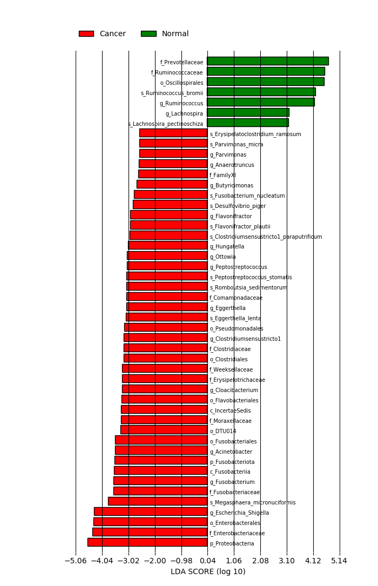{width="80%"}

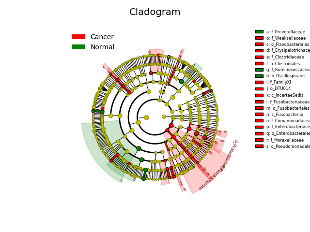{width="80%"}

<br/>

## PreLect

[PreLectR](https://github.com/YinchengChen23/PreLectR) is an R package
implementing the PreLect algorithm, which integrates L1 regularization
with an inverted prevalence penalty to select universal and informative
features in sparse data.


It supports four tasks: binary classification,
multi-class classification, regression, and time-to-event analysis.

$\text{Binary classification} : J(\mathbf{w}) = \text{BCE}(\mathbf{y}, \hat{\mathbf{y}}) + \color{red}{\lambda \sum_j \frac{|\mathbf{w}_j|}{p_j}}$

$\text{Regression} : J(\mathbf{w}) = \text{MSE}(\mathbf{y}, \hat{\mathbf{y}}) + \color{red}{\lambda \sum_j \frac{|\mathbf{w}_j|}{p_j}}$

$\text{Multi-class classification} : J(\mathbf{w}) = \frac{1}{c} \sum_{l=1}^{c} \left( \text{BCE}(\mathbf{y}_l, \hat{\mathbf{y}}_l) + \color{red}{\lambda \sum_{j=1}^{d}\frac{|\mathbf{w}_{j,l}|}{p_{j,l}}} \right)$

$\text{Time-to-event} : J(\mathbf{w}) = h_0(t) \cdot e^{\sum{x_i \cdot w}}+ \color{red}{\lambda \sum_j \frac{|\mathbf{w}_j|}{p_j}}$

Based on [previous
studies](https://www.nature.com/articles/s41467-021-23821-6), we
recommend using variance-stabilizing transformation (VST) for data
normalization.

```{r, eval = TRUE, message=FALSE, warning=FALSE, results='hide', collapse=TRUE}
# Variance Stabilization Transformation
library(DESeq2)
library(PreLectR)
data_pseudo_count <- data + 1
meta$Class <- factor(meta$Class)

dds <- DESeqDataSetFromMatrix(countData = data_pseudo_count,
                              colData = meta,
                              ~ Class)

vst <- varianceStabilizingTransformation(dds, fitType="mean", blind= T)

vst_table <- assay(vst)

# feature-wise z-standardization
data_scaled <- t(scale(t(as.matrix(vst_table))))

```

We will only use z-standardized table `data_scaled` and raw count table
`data` for the subsequent analyses.

Automatically perform lambda scanning to identify 30 lambda values for
examination.

```{r, eval = TRUE, message=FALSE, warning=FALSE, collapse=TRUE}
meta$Class <- factor(meta$Class, levels = c("Normal", "Cancer"))  # assign "Normal" as control sample
lrange <- AutoScanning(data_scaled, data, meta$Class, step =30)
length(lrange)
exp(lrange)

# Examining the testing lambda.
dir.create("~/Course/NDMC_2025/tmp/PreLect_tmp")
output_path <-"~/Course/NDMC_2025/tmp/PreLect_tmp"
tuning_res <- LambdaTuningParallel(data_scaled, data, meta$Class, lrange, n_cores=10, outpath=output_path)
```

```{r, eval = TRUE}
head(tuning_res$TuningResult)
```

```{r, eval = TRUE}
head(tuning_res$PvlDistSummary)
```

Determine the optimal lambda by partitioning tree.

```{r, eval = TRUE, message=FALSE, warning=FALSE, collapse=TRUE, fig.width=6, fig.height=5}
lmbd_picking <- LambdaDecision(tuning_res$TuningResult, tuning_res$PvlDistSummary, maxdepth=5, minbucket=3)

lmbd_picking$selected_lmbd_plot/lmbd_picking$pvl_plot

print(lmbd_picking$opt_lmbd)
```

PreLect execution and get the property for each feature

```{r, eval = TRUE, message=FALSE, warning=FALSE, collapse=TRUE}
# We strongly suggest using 100000 for max_iter to achieve more accurate results.
s=Sys.time()
prevalence <- GetPrevalence(data)
PreLect_out <- PreLect(data_scaled, prevalence, meta$Class, lambda=lmbd_picking$opt_lmbd, max_iter = 100000)
print(Sys.time()-s)


featpropt <- FeatureProperty(data, meta$Class, PreLect_out, task="classification")

print(paste(nrow(featpropt[featpropt$selected == 'Selected', ]), 'features were selected'))

print(paste('median of prevalence :', median(featpropt$prevalence[featpropt$selected == 'Selected'])))

write.table(featpropt, "~/Course/NDMC_2025/tmp/PreLect_tmp/feature_propt.txt", quote=FALSE, sep="\t")
head(featpropt)
```

Selection profile visualization and evaluation

```{r, eval = TRUE, message=FALSE, warning=FALSE, collapse=TRUE, fig.width=4, fig.height=3}
ggplot(featpropt, aes(x = prevalence, y = meanAbundance, color=selected)) + geom_point() +
  scale_color_manual(values = c('Selected'='red', 'Others'='#AAAAAA')) + 
  scale_y_log10(breaks = trans_breaks("log10", function(x) 10^x),
                labels = trans_format("log10", math_format(10^.x))) +
  theme_bw()+ theme(panel.background = element_rect(fill = "white", colour = "white"))

ggplot(featpropt, aes(x = logFC, y = prevalence, color=selected)) + geom_point() +
  scale_color_manual(values = c('Selected'='red', 'Others'='#AAAAAA')) + 
  theme_bw()+ theme(panel.background = element_rect(fill = "white", colour = "white"))
```


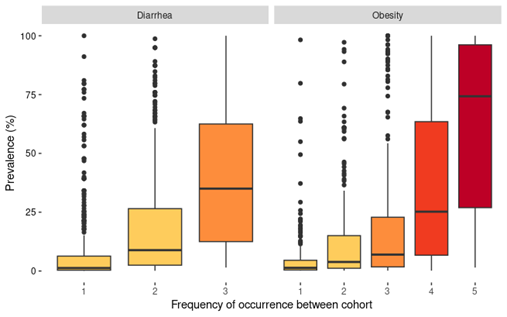{width="80%"}

We observed that features present in multiple datasets tend to have higher prevalence within those datasets. This finding suggests that features with higher prevalence in one dataset are more likely to be universal across different datasets.


```{r, eval = TRUE, message=FALSE, warning=FALSE, collapse=TRUE}
y <- ifelse(meta$Class == "Cancer", 1, 0) 

split   <- TrainTextSplit(y, ratio = 0.8)
X_train <- data_scaled[, split$train_idx]
X_test  <- data_scaled[, split$test_idx]
y_train <- y[split$train_idx]
y_test  <- y[split$test_idx]

perf <- evaluation(X_train, y_train, X_test, y_test, featpropt$coef, task='classification')
perf
```

```{r, eval = TRUE, message=FALSE, warning=FALSE, collapse=TRUE}
result <- TaxaProperty(featpropt, taxa, "Family",  pvl_filter = 0.5)

mycolor <- c("Normal" = "#FFCC22", "Cancer" = "#EE7700")
result$effectSizePlot + scale_fill_manual(values = mycolor) +
   geom_hline(yintercept = 0, color='black', linetype='dashed')
head(result$selectedInfo)
```

## Basal feature visualization

we use edgeR to demonstrate the several plots.

```{r, collapse=TRUE, message = FALSE, warning = FALSE, eval=T, fig.width=4, fig.height=3}
library(edgeR)

ASV <- phyloseq::otu_table(data, taxa_are_rows = T)
sampledata <- phyloseq::sample_data(meta, errorIfNULL = T)
phylo <- phyloseq::merge_phyloseq(ASV, sampledata)
test <- phyloseq_to_edgeR(physeq = phylo, group = "Class")
et = exactTest(test)
out = topTags(et, n=nrow(test$table), adjust.method="BH", sort.by="PValue")
edgeR_result <- out@.Data[[1]]
edgeR_selected <- edgeR_result[edgeR_result$FDR < 0.05,]

et = exactTest(test)
et = et$table
et$select <- "drop"
et$select[rownames(et) %in% rownames(edgeR_selected)] = "selected"

data_freq <- data
for(i in 1:ncol(data_freq)){
  data_freq[,i] <- data_freq[,i]/colSums(data_freq)[i]
}


get_pvl <- function(m){
  m_ <- m
  m_[m_ > 0] = 1
  m_ <- as.matrix(m_)
  return(as.numeric(rowSums(m_)/ncol(m_)))
}

variance <- c()
for(i in 1:nrow(data_freq)){
  variance <- c(variance, log(sd(data_freq[i,])**2))
}

et$variation <- variance
et$prevalence <- get_pvl(data)
et$neglog2p <- -log(et$PValue,2)
et$select <- factor(et$select, levels = c('selected','drop'))

ggplot(et, aes(x = logFC, y = neglog2p, color = select)) + geom_point() +
  xlab('log(FC) Cancer vs. Normal') + ylab('-log2(p value)') + 
  scale_color_brewer(palette = 'Set1') + theme(axis.line = element_line(linetype = 1,colour = 'black'),
        panel.background = element_rect(I(0)),
        panel.grid.major = element_line(colour = NA),
        panel.grid.minor = element_line(colour = NA))

ggplot(et, aes(x = logCPM, y = logFC, color = select)) + geom_point() +
  xlab('Relative abundance (logCPM)') + ylab('log(FC) Cancer vs. Normal') + 
  scale_color_brewer(palette = 'Set1') +
  theme(axis.line = element_line(linetype = 1,colour = 'black'),
        panel.background = element_rect(I(0)),
        panel.grid.major = element_line(colour = NA),
        panel.grid.minor = element_line(colour = NA))

ggplot(et, aes(x = prevalence, y = logFC, color = select)) + geom_point() +
  xlab('Prevalence') + ylab('log(FC) Cancer vs. Normal') + 
  scale_color_brewer(palette = 'Set1') +
  theme(axis.line = element_line(linetype = 1,colour = 'black'),
        panel.background = element_rect(I(0)),
        panel.grid.major = element_line(colour = NA),
        panel.grid.minor = element_line(colour = NA))

ggplot(et, aes(x = prevalence, y = logCPM, color = select)) + geom_point() +
  xlab('Prevalence') + ylab('Relative abundance (logCPM)') + 
  scale_color_brewer(palette = 'Set1') +
  theme(axis.line = element_line(linetype = 1,colour = 'black'),
        panel.background = element_rect(I(0)),
        panel.grid.major = element_line(colour = NA),
        panel.grid.minor = element_line(colour = NA))

ggplot(et, aes(x = logCPM, y = variance, color = select)) + geom_point() +
  xlab('Relative abundance (logCPM)') + ylab('log(variance)') + 
  scale_color_brewer(palette = 'Set1') +
  theme(axis.line = element_line(linetype = 1,colour = 'black'),
        panel.background = element_rect(I(0)),
        panel.grid.major = element_line(colour = NA),
        panel.grid.minor = element_line(colour = NA))

ggplot(et, aes(x = prevalence, y = variance, color = select)) + geom_point() +
  xlab('Prevalence') + ylab('log(variance)') +
  scale_color_brewer(palette = 'Set1') +
  theme(axis.line = element_line(linetype = 1,colour = 'black'),
        panel.background = element_rect(I(0)),
        panel.grid.major = element_line(colour = NA),
        panel.grid.minor = element_line(colour = NA))
```

<br/>

# Functional Prediction

## PICRUSt2

Prepare files for running [PICRUSt2](https://huttenhower.sph.harvard.edu/picrust/) by extracting the selected ASVs.

```{r, eval = TRUE, message=FALSE, warning=FALSE, collapse=TRUE}
# please ensure the "ASV.fasta" is in "output_path" directory
output_path <- '~/Course/NDMC_2025/tmp'
dir(output_path)
selected_id <- featpropt$FeatName[featpropt$selected == 'Selected'] # selected by PreLect
data_sub <- data[selected_id, ]  # if you want to use whole ASVs, just data_sub <- data
data_sub <- rbind(colnames(data_sub), data_sub)
colnames(data_sub) <- NULL
rownames(data_sub)[1] <- "#OTU ID"
write.table(data_sub, paste0(output_path,"/for_PICRUSt2.tsv"), sep = "\t", quote=F, col.names	=F)
```

{width="80%"}

Conduct the PICRUSt2 pipeline via docker

```{bash, eval = FALSE}
# Bash
# run the PICRUSt2 pipeline

# ensure the "ASV.fasta" and "for_PICRUSt2.tsv" files are in the same directory 
# and set the working directory to that location before running this script.
$ cd ~/Course/NDMC_2025/tmp
$ docker run \
$    -u $UID:$(id -g) \              # perform this work as the current user.
$    -i -t \                        # interactive terminal mode, allowing you to interact with the container.
$    --rm \                         # automatically remove the container after it exits to save disk space.
$    -v $(pwd):/tmp \               # bind mount the current directory ($(pwd)) to /tmp in the container.
$    yincheng23/picrust2:0.2.0 \    # specify the Docker image to use; it will be pulled from Docker Hub if not available locally.
$    sh /bin/Run_picrust2.sh 10     # use the shell to execute the built-in script (Run_picrust2.sh) with 10 cores for parallel processing.
    
# the results will store as ~/Course/NDMC_2025/tmp/PICRUSt2
```

output file : ./PICRUSt2/KO/pred_metagenome_contrib.tsv - Represents the relationship between functions and taxa.

output file : ./PICRUSt2/KO/pred_metagenome_unstrat_descrip.tsv - Contains KO (KEGG Orthology) abundances for each sample along with detailed gene descriptions.

output file : ./PICRUSt2/KO/pred_metagenome_unstrat.tsv.gz - Provides KO abundances for each sample.

<br/>


Since `PICRUSt2` predicts gene abundance based on taxa abundance, differential expression analysis using this approach may be less convincing. Therefore, we adopted a `GSEA` strategy, ranking taxa by fold change based on their abundance. Using insights provided by `PICRUSt2`, we examined which species carry specific genes to assess the KOs that are actively expressed or suppressed.

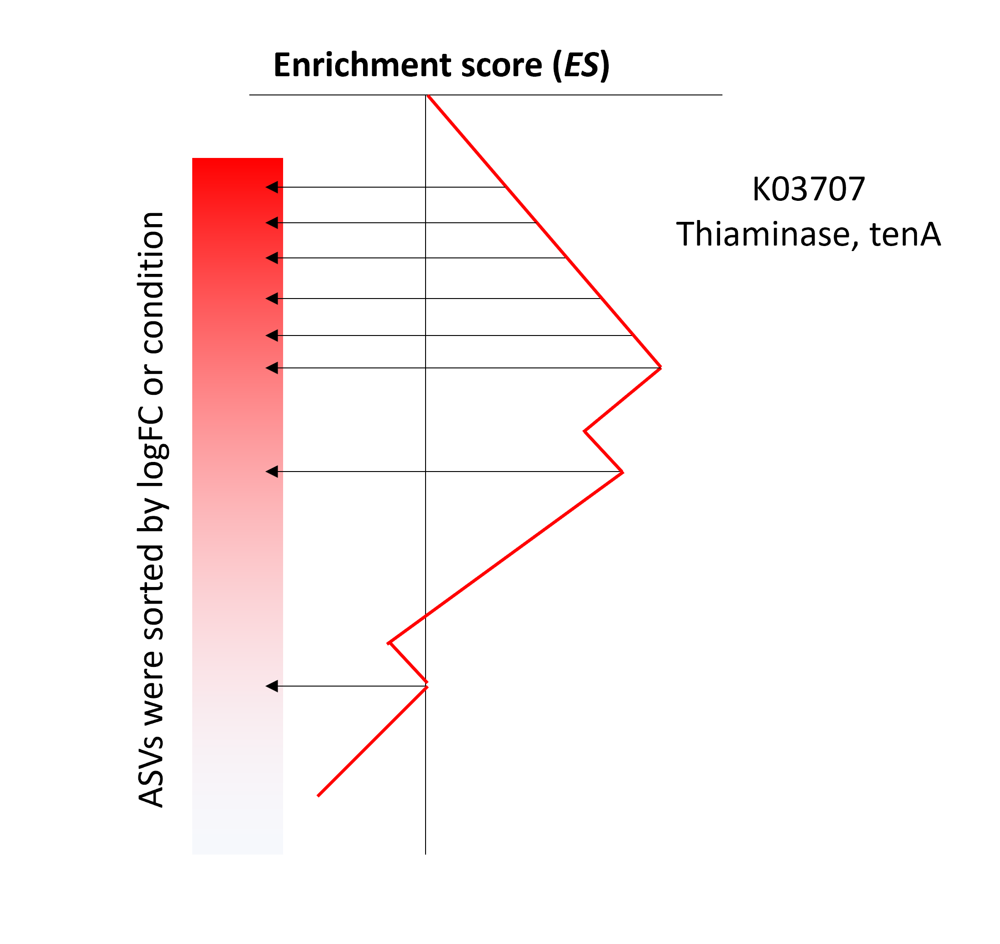{width="70%"}

Conduct the GSEA with permutation test via `GSEATestwithFC` or `GSEATest`
```{r, eval = TRUE, message=FALSE, warning=FALSE, results='hide'}
# load the KO-taxa relationship file
# output_path is the directory you save the for_PICRUSt2.tsv file
KOindex <- read.table(paste0(output_path,"/PICRUSt2/KO/pred_metagenome_contrib.tsv"), sep = "\t", header = TRUE)

# extract the selected ASV identifiers
selected_id <- featpropt$FeatName[featpropt$selected == 'Selected']

# Provide the raw count table for logFC calculation, subsetting with the selected ASVs.
# Additionally, specify the labels for each sample and the name of the case sample group.
GSEAresult <- GSEATestwithFC(KOindex, data[selected_id, ], meta$Class, "Cancer")

## Building the KO-to-taxa mapper...
## Done. In total, 5755 KOs need to be processed.
## Shuffling the labels for GSEA...
## Performing GSEA to identify activated KOs...
##   |=======================================================================================================| 100%
## Shuffling the labels for GSEA...
## Performing GSEA to identify suppressed KOs...
##   |=======================================================================================================| 100%
## Done.


# If the grouping variable is continuous (e.g., body mass index), use the following line instead:
# GSEAresult <- GSEATest(KOindex, data[selected_id, ], meta$body.mass.index)
```

Selected the enriched KOs with z-score

```{r, eval = TRUE, message=FALSE, warning=FALSE, collapse=TRUE}
Actived_result <- GSEAresult$Actived_KO
Actived_result <- Actived_result[!is.na(Actived_result$z), ]
Actived_result <- Actived_result[Actived_result$z > 2,]
Actived_result <- Actived_result[Actived_result$p < 0.05,]
nrow(Actived_result)
head(Actived_result)
```

<br/>


Since `PICRUSt2` does not provide detailed information for each KO, we preprocess the KO-pathway table using the KEGG API.

```{r, eval = TRUE, message=FALSE, warning=FALSE, collapse=TRUE}
kodb_path <- system.file("exdata", "total_KO_pathway.rds", package = "PreLectR")
KOinfo <- readRDS(kodb_path)
head(KOinfo)
```

Examining the condition enriched pathway with Fisher's exact test via `PathwayEnrichment`

```{r, eval = TRUE, message=FALSE, warning=FALSE, collapse=TRUE}
KOinfo <- KOinfo[KOinfo$KO %in% unique(KOindex$function.), ]
Actived_result <- GSEAresult$Actived_KO
Actived_result <- Actived_result[!is.na(Actived_result$z), ]
Actived_result <- Actived_result[Actived_result$z > 2,]
Actived_result <- Actived_result[Actived_result$p < 0.05,]
selected_KOs <- Actived_result$KO

enrichPW <- PathwayEnrichment(selected_KOs, KOinfo)
enrichPW$q <- p.adjust(enrichPW$p, method = 'fdr')
enrichPW <- enrichPW[enrichPW$q < 0.05, ]
nrow(enrichPW)

head(enrichPW)
```


```{r, eval = TRUE, message=FALSE, warning=FALSE, collapse=TRUE}
enrichPW$pathway <- factor(enrichPW$pathway, levels = enrichPW$pathway[order(enrichPW$count)])
ggplot(enrichPW, aes(x = pathway, y = count, fill = q)) + ggtitle('Enhanced in colorectal cancer') +
  geom_bar(stat="identity",colour = "black",size = 0.1) +  coord_flip() + labs(y = 'KO Hits', fill = "q-value") +
  scale_fill_continuous(low = "red", high = "blue", limits = range(enrichPW$q)) +
  theme(axis.text.y = element_text(color='black', size='10'),
        axis.line = element_line(linetype = 1,colour = 'black'),
        axis.title.y = element_blank(),
        panel.background = element_rect(I(0)),
        panel.grid.major = element_line(colour = NA),
        panel.grid.minor = element_line(colour = NA)) + coord_flip()
```


<br/>


## RPM
Reference Pathways Mapper (RPM) utilizes a reference pathways database, which is a flat file listing pathway/module reactions in sequential order. Tab-separated reactions indicate alternative reactions (OR operation), while line breaks and comma-separated reactions represent reactions that are all required for pathway completion (AND operation).


Below is a snippet from the `human gut metabolic modules (GMMs)` database, as described by [Vieira-Silva et al. 2016](https://www.nature.com/articles/nmicrobiol201688).


```{r, eval = FALSE}
MF0001	arabinoxylan degradation
K01209	K15921	K01181	K01198	K15531	K18205
///
MF0003	pectin degradation I
K01051
K01184,K01213	K18650
///
MF0103	mucin degradation
K01186
K05970
K01132	K01135	K01137	K01205
K01207	K12373	K14459
K01205	K01207	K12373	K01227	K13714
K01206
///
```

#### Installation
  
According to [original repository](https://github.com/omixer/omixer-rpmR?tab=readme-ov-file)

```{bash, eval=FALSE}
$ wget https://github.com/omixer/omixer-rpmR/releases/download/0.3.3/omixerRpm_0.3.3.tar.gz
$ R CMD INSTALL omixerRpm_0.3.3.tar.gz
```

<br/>

#### Pathway mapping 

```{r, eval = TRUE, message=FALSE, warning=FALSE, collapse=TRUE}
library(omixerRpm)
library(dplyr)
library(tidyr)

KOtable <- read.table(paste0(output_path,"/PICRUSt2/KO/pred_metagenome_contrib.tsv"), sep = "\t", header = TRUE)

colnames(KOtable)[2] <- 'fun'
sumtb <- KOtable %>% group_by(sample, fun) %>% summarise(sum_rel_function_abun=sum(taxon_rel_function_abun))
tmp <- spread(sumtb, key = sample, value = sum_rel_function_abun)
colnames(tmp)[1] <- 'entry'
tmp[is.na(tmp)] <- 0

mods <- rpm(tmp, minimum.coverage=0.3, annotation = 1)
db <- loadDefaultDB()
getNames(db, mods@annotation[1,])
coverage <- asDataFrame(mods, "coverage")
module  <- mods@abundance
rownames(module) <- coverage$Description
head(module)
```

<br/>

#### Module visualization

Please ensure that the dataframe `meta` has a column named `group`, which records the grouping information.

Only binary grouping is supported in the following process.

```{r, eval = TRUE, message=FALSE, warning=FALSE, collapse=TRUE}
meta$group <- meta$Class # pleas ensure this

# GMMviz function is sourced from utils.R
results <- GMMviz(module, meta, 'Normal') # please assign the control name as the third parameter.
sigdf <- results$significance_df
boxdf <- results$relative_abundance_df
covdf <- results$coverage_df

sigdf <- sigdf[sigdf$p < 0.01, ]
boxdf <- boxdf[boxdf$module %in% sigdf$module,]
covdf <- covdf[covdf$module %in% sigdf$module,]

module_order <- sigdf$module[order(sigdf$log2FC, decreasing = F)]
sigdf$module <- factor(sigdf$module, levels = module_order)
boxdf$module <- factor(boxdf$module, levels = module_order)
covdf$module <- factor(covdf$module, levels = module_order)

mycolor <- c("Normal" = "#FFCC22", "Cancer" = "#EE7700") # color assignment
p1 <- ggplot(boxdf, aes(x = module, y = value, color = group)) +  coord_flip() +
      scale_x_discrete() +
      ylab("Relative abundance (%)") + scale_color_manual(values = mycolor) +
      theme(panel.background = element_rect(fill = 'transparent'),
        panel.grid = element_blank(),
        axis.ticks.length = unit(0.4,"lines"),
        axis.ticks = element_line(color='black'),
        axis.line = element_line(colour = "black"),
        axis.text.y = element_text(colour='black',size=12),
        axis.title.y = element_blank(),
        legend.title=element_blank(),
        legend.position = 'top')
sing = 1
for (i in 1:(nrow(sigdf)-1)){
  sing = sing * -1
  p1 <- p1 + annotate('rect', xmin = i+0.5, xmax = i+1.5, ymin = -Inf, ymax = Inf,
                      fill = ifelse(sing > 0, 'white', 'gray95'))
}
p1 <- p1 + geom_boxplot(outlier.shape = NA, width = 0.5)

p2 <- ggplot(sigdf, aes(x = module, y = log2FC, fill = group)) +  coord_flip() + 
      geom_bar(stat = "identity", width=.5, position = "dodge") + scale_x_discrete() +
      scale_fill_manual(values = mycolor) + ylab("log2(FC)") +
      theme(panel.background = element_rect(fill = 'transparent'),
        panel.grid = element_blank(),
        axis.ticks.length = unit(0.4,"lines"),
        axis.ticks = element_line(color='black'),
        axis.line = element_line(colour = "black"),
        #axis.text = element_text(colour='black',size=10),
        axis.text.y = element_blank(),
        axis.title.y = element_blank(),
        legend.title=element_blank(),
        legend.position = 'top')
sing = 1
for (i in 1:(nrow(sigdf)-1)){
  sing = sing * -1
  p2<- p2 + annotate('rect', xmin = i+0.5, xmax = i+1.5, ymin = -Inf, ymax = Inf,
                      fill = ifelse(sing > 0, 'white', 'gray95'))
}
p2 <- p2 + geom_bar(stat = "identity", width=.5, position = "dodge")

p3 <- ggplot(covdf, aes(x = module, y = mean, fill = group)) + 
      scale_x_discrete() + coord_flip() + scale_fill_manual(values = mycolor) +
      theme(panel.background = element_rect(fill = 'transparent'),
        panel.grid = element_blank(),
        axis.ticks.length = unit(0.4,"lines"),
        axis.ticks = element_line(color='black'),
        axis.line = element_line(colour = "black"),
        axis.text = element_text(colour='black',size=10),
        axis.text.y = element_blank(),
        axis.title.y = element_blank(),
        legend.title=element_blank(),
        legend.position = 'top')
sing = 1
for (i in 1:(nrow(sigdf)-1)){
  sing = sing * -1
  p3 <- p3 + annotate('rect', xmin = i+0.5, xmax = i+1.5, ymin = -Inf, ymax = Inf,
                     fill = ifelse(sing > 0, 'white', 'gray95'))
}
p3 <- p3 + geom_bar(stat="identity", position=position_dodge()) + ylab("Coverage (%)") +
           geom_errorbar(aes(ymin=mean-std, ymax=mean+std), width=.3, position=position_dodge(.9)) 

p1 + p2 + p3
```


<br/>


# Co-Occurrence Network


```{r, collapse=TRUE, message = FALSE, warning = FALSE, eval=T}
library(Rcpp)
library(igraph) 
library(gtools)
library(Matrix)
library(SpiecEasi)
sourceCpp("source/Microbial_network.cpp")
```


## SPIEC-EASI

[SPIEC-EASI(**SP**arse **I**nvers**E** **C**ovariance **E**stimation for **E**cological **A**ssociation **I**nference)](https://journals.plos.org/ploscompbiol/article?id=10.1371/journal.pcbi.1004226) infers direct microbial interactions from compositional data using a graphical model. It transforms counts into log-ratios, estimates a sparse inverse covariance matrix with regularization (e.g., Graphical Lasso), and builds a network where non-zero elements indicate direct species relationships, overcoming spurious correlations.


```{r, collapse=TRUE, message = TRUE, warning = FALSE, eval=T}
pvl_filter <- 0.1
SpiecEasi_threshold <- 0.7

# filter low prevalence feature
pdata <- data
pdata[pdata > 0] <- 1
keep_id <- rownames(pdata)[rowSums(pdata) > ncol(pdata)*pvl_filter]
filerted_data <- data[keep_id,]
dim(filerted_data)

# run SpiecEas mb = Neighborhood Selection, glasso = graph LASSO
SPIEC_EASI <- spiec.easi(t(filerted_data), method='mb', lambda.min.ratio=1e-2, nlambda=15)
adjm <- getOptMerge(SPIEC_EASI)
adjm <- as.matrix(adjm)
adjm[adjm < SpiecEasi_threshold] <- 0

edge_table <- make_edgetable(adjm, filerted_data)
node_table <- make_nodetable(edge_table, data, taxa)
```

<br/>

## SparCC

[SparCC (**S**parse **C**orrelations for **C**ompositional data)](https://journals.plos.org/ploscompbiol/article?id=10.1371/journal.pcbi.1002687) infers microbial interactions from compositional data by estimating correlations while accounting for the sum constraint. It assumes most species pairs are uncorrelated, uses log-ratio variance to approximate correlations, and applies a sparse model to focus on strong relationships. Iterative refinement reduces noise, producing a correlation network for ecological insights.

```{r, collapse=TRUE, message = TRUE, warning = FALSE, eval=F}
pvl_filter <- 0.1
SparCC_threshold <- 0.3
SparCC_conf_threshold <- 0.05

# filter low prevalence feature
pdata <- data
pdata[pdata > 0] <- 1
keep_id <- rownames(pdata)[rowSums(pdata) > ncol(pdata)*pvl_filter]
filerted_data <- data[keep_id,]
dim(filerted_data)

# run SparCC
sparcc_cor <- sparcc(t(filerted_data))
sparcc_boost <- sparccboot(t(filerted_data), R = 100, ncpus = 10)
sparcc_p <- pval.sparccboot(sparcc_boost)
cors <- sparcc_p$cors
pvals <- sparcc_p$pvals

# adjacency matrix constructing
sparCCpcors <- diag(0.5, nrow = dim(sparcc_cor$Cor)[1], ncol = dim(sparcc_cor$Cor)[1])
sparCCpcors[upper.tri(sparCCpcors, diag=FALSE)] <- cors
sparCCpcors <- sparCCpcors + t(sparCCpcors)
sparCCpval <- diag(0.5, nrow = dim(sparcc_cor$Cor)[1], ncol = dim(sparcc_cor$Cor)[1])
sparCCpval[upper.tri(sparCCpval, diag=FALSE)] <- pvals
sparCCpval <- sparCCpval + t(sparCCpval)
rownames(sparCCpcors) <- rownames(filerted_data)
colnames(sparCCpcors) <- rownames(filerted_data)
rownames(sparCCpval) <- rownames(filerted_data)
colnames(sparCCpval) <- rownames(filerted_data)
sparCCpcors[abs(sparCCpcors) < SparCC_threshold | sparCCpval > SparCC_conf_threshold] = 0

edge_table <- make_edgetable(sparCCpcors, filerted_data)
node_table <- make_nodetable(edge_table, data, taxa)
```


## Cluster identification

```{r, collapse=TRUE, message = TRUE, warning = FALSE, eval=F}
net <- make_net(edge_table)
net_pack <- graph_from_incidence_matrix(net, mode = "total", weighted = TRUE)
#clustB <- cluster_edge_betweenness(net_pack)
clustW <- cluster_walktrap(net_pack)
clustL <- cluster_louvain(net_pack)
clustG <- cluster_fast_greedy(net_pack)
clustLE <- cluster_leading_eigen(net_pack)
Modularity <- data.frame(Method = c("Random walks", "Louvain", "Greedy", "Non-negative eigenvector"),
                         Modularity = c(modularity(clustW), modularity(clustL),
                                        modularity(clustG),modularity(clustLE)))
Modularity
Modul_number_cutoff <- 3  # if the number of members in a cluster is lower than the cutoff, discard this cluster.
edge_table <- assignModul(edge_table,clustW, "RandomWalks", Modul_number_cutoff)
edge_table <- assignModul(edge_table,clustL, "Louvain", Modul_number_cutoff)
edge_table <- assignModul(edge_table,clustG, "Greedy", Modul_number_cutoff)
edge_table <- assignModul(edge_table,clustLE, "Leading_eigen", Modul_number_cutoff)

write.csv(edge_table, "edge_table.csv", row.names = F,quote = F)
write.csv(node_table, "node_table.csv", row.names = F,quote = F)
```

Next, you can visualize with [Gephi](https://gephi.org/users/download/).


# Guide to Shotgun Metagenomic Data

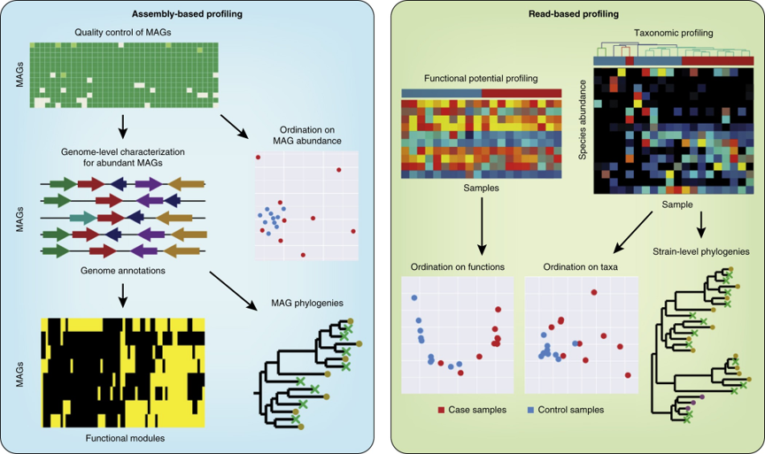{width="80%"}

## Read bases pipeline

Shotgun metagenomics involves sequencing all genetic material in a sample, generating vast amounts of short DNA fragments known as read bases. These raw reads undergo quality control, filtering, and taxonomic or functional annotation.

[The Huttenhower Lab](https://huttenhower.sph.harvard.edu/home/) has developed a comprehensive pipeline called `bioBakery Workflows`, which includes:

+ **KneadData**: Read quality control and host contamination removal

+ **MetaPhlAn**: Taxonomic profiling

+ **HUMAnN**: Functional profiling

+ **PhyloPhlAn**: Phylogenetic analysis


Our lab also developed a user friendly `bioBakery Workflows` named [`BacNex`](https://github.com/RynoLiu/BacNex)


```{base, eval=F}
# Installation
$ git clone https://github.com/RynoLiu/BacNex.git
$ conda env create -f /env/bacnex_env_v2.yml --name bacnex_env
$ conda activate bacnex_env

# Build database
$ bash BacNex.sh make_database -o $OUTDIR

# Preprocess (KneadData -> MetaPhlAn -> HUMAnN)
$ bash BacNex.sh preprocess -i $seq_dir \
                            -o $outdir \
                            -db $DATABASE \
                            --threads 10

# Output HUMAnN table
$ python BacNex.py make_table -i $KO_TSV \
                              -o $OUTDIR

# shiny APP
$ bash BacNex.sh app -w $WORK_DIR \
                     -t 10
```


```{base, eval=F}
$ git clone https://github.com/RynoLiu/BacNex.git
$ conda env create -f /env/bacnex_env_v2.yml --name bacnex_env
$ conda activate bacnex_env
```


## Assembly bases pipeline

Assembly bases, on the other hand, refer to contigs or scaffolds reconstructed from overlapping reads, providing longer genomic sequences for better functional and phylogenetic analysis.

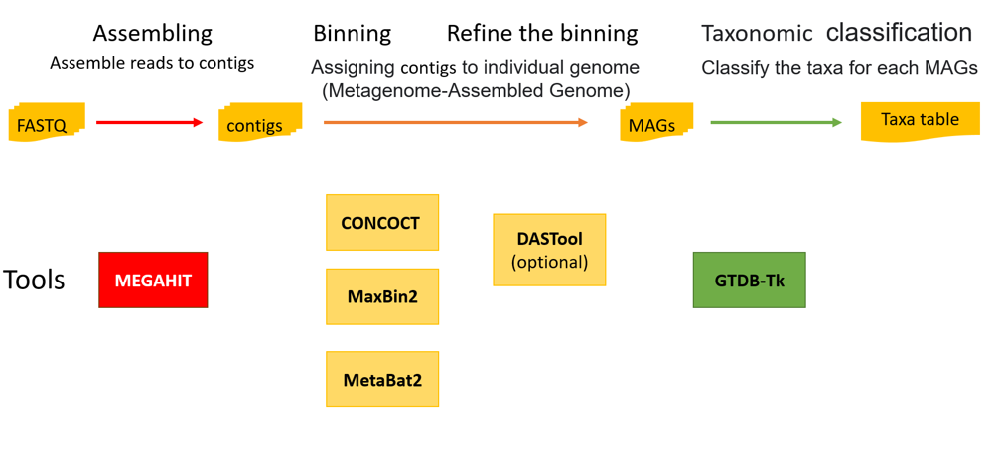{width="80%"}

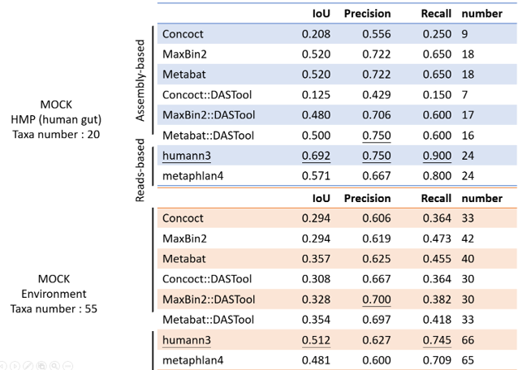{width="80%"}

While read-based analysis offers high-resolution species profiling, assembly-based approaches improve gene prediction and strain-level characterization. Choosing between them depends on study objectives, sample complexity, and computational resources.
